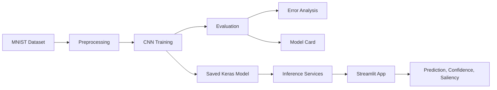

# CodeAlpha Handwritten Character Recognition


Production-style handwritten digit recognition project built for the CodeAlpha Machine Learning Internship. The project uses MNIST, a TensorFlow/Keras CNN, reusable preprocessing and inference services, model evaluation, error analysis, saliency explainability, automated tests, and a Streamlit deployment interface.

## Project Overview

This repository demonstrates an end-to-end computer vision workflow for recognizing handwritten digits from 0 to 9. It is structured as a deployable ML application, not a notebook-only experiment.

The application supports image upload, built-in MNIST examples, and an optional drawing canvas. It shows preprocessing previews, predictions, confidence, top-3 probabilities, all-class probabilities, saliency maps, session history, and downloadable reports.

## Live Demo Status

Deployment-ready release candidate. No public live URL is claimed yet.

Deployment is prepared for Streamlit Community Cloud or another Python 3.11-compatible host. See [Deployment Guide](docs/DEPLOYMENT_GUIDE.md).

## Repository Snapshot

| Area | Status |
| --- | --- |
| Project architecture | Complete |
| CNN training and evaluation | Complete |
| Explainability and error analysis | Complete |
| Streamlit inference app | Complete |
| Drawing canvas | Enabled with defensive fallback |
| Automated tests | Complete |
| CI workflow | Prepared |
| Final screenshots | Pending manual capture |
| Live deployment | Pending |

## Key Features

- CNN-based handwritten digit recognition
- TensorFlow/Keras implementation
- Modular ML pipeline with reusable services
- Image upload inference
- Built-in MNIST sample inference
- Optional interactive drawing canvas
- 28x28 preprocessing preview
- Top-1 prediction and top-3 probabilities
- Full probability distribution across all digits
- Confidence bands and low-confidence warnings
- Saliency-map explainability and overlay preview
- Confidence analysis and misclassification analysis
- Model card and final model selection report
- Streamlit deployment-ready interface
- Service-level tests and CI workflow

## Application Screenshots

Final screenshots are pending manual capture from the running app. The screenshot checklist is available in [docs/screenshots/README.md](docs/screenshots/README.md).

| Screenshot | Status |
| --- | --- |
| Home and prediction workspace | Pending capture |
| Canvas input | Pending capture |
| Prediction result with saliency | Pending capture |
| Model information page | Pending capture |
| Error analysis page | Pending capture |
| About project page | Pending capture |

## ML Workflow



## CNN Architecture

The baseline model uses a compact convolutional neural network suitable for MNIST-scale digit recognition:

```text
Input: 28 x 28 x 1 grayscale image
Conv2D
MaxPooling2D
Conv2D
MaxPooling2D
Flatten
Dense
Dropout
Dense softmax output for 10 digit classes
```

The selected saved model is:

```text
models/mnist_cnn_baseline.keras
```

## Dataset

The project uses the MNIST handwritten digit dataset through `tensorflow.keras.datasets.mnist`.

- 60,000 training images
- 10,000 test images
- 10 classes: digits 0 through 9
- Original image size: 28 x 28 grayscale pixels

MNIST is clean and standardized, so real-world handwritten images may require stronger preprocessing and broader validation.

## Preprocessing Pipeline

The inference pipeline converts incoming images into model-ready tensors:

1. Convert image input to grayscale.
2. Normalize foreground/background orientation for MNIST-style digits.
3. Resize to 28 x 28 pixels.
4. Scale values to the 0 to 1 range.
5. Reshape to `(1, 28, 28, 1)`.
6. Reject blank canvas inputs cleanly.

The Streamlit app shows both the original input and the processed 28 x 28 model input.

## Model Performance

Values below come from the latest verified artifacts in `reports/final_model_selection/final_model_selection_summary.csv`.

| Metric | Value |
| --- | ---: |
| Training Accuracy | 98.66% |
| Validation Accuracy | 99.08% |
| Test Accuracy | 99.03% |
| Test Loss | 0.0298 |
| Test Error Rate | 0.97% |
| Mean Correct Confidence | 99.49% |
| Mean Incorrect Confidence | 74.00% |

Reproducibility note: the saved model and metrics were generated before seed support was added. Future training runs use seed `42` for Python, NumPy, and TensorFlow. Exact metrics may still vary slightly across hardware due to TensorFlow CPU optimizations and floating-point behavior.

## Error Analysis

The project includes structured error analysis for model behavior inspection:

- Misclassified example visualization
- Common confusion pairs
- Per-class performance review
- Confidence distribution analysis
- High-confidence correct prediction review
- Final model selection summary

Key artifacts:

- [Error analysis report](reports/error_analysis/error_analysis_report.md)
- [Final model selection report](reports/final_model_selection/final_model_selection_report.md)
- [Misclassified examples](images/error_analysis/misclassified_examples.png)

## Explainability

Gradient-based saliency maps are used to highlight pixels that most influenced model predictions. These maps are useful for qualitative inspection, but they are sensitivity visualizations rather than causal explanations.

Key artifacts:

- [Explainability report](reports/explainability/explainability_report.md)
- [Saliency examples](images/explainability/saliency_examples.png)

## Streamlit Application

The app is implemented in `app/app.py` with modular services and UI components.

Supported input modes:

- Upload an image file
- Select a built-in MNIST sample
- Draw a digit on the optional canvas

Canvas input uses `streamlit-drawable-canvas==0.9.3` and is imported defensively. If the optional component cannot load, the app still starts and upload/sample inference remain available.

## Quick Start

Use Python 3.11.

```bash
python -m venv .venv
```

On Windows:

```powershell
.\.venv\Scripts\activate
```

On Linux/macOS:

```bash
source .venv/bin/activate
```

Install runtime dependencies:

```bash
python -m pip install --upgrade pip
pip install -r requirements.txt
```

Install notebook-only dependencies only if you want to run notebooks:

```bash
pip install -r requirements-dev.txt
```

Run the app:

```bash
streamlit run app/app.py
```

## Running Tests

```bash
python -m compileall app src
python -m app.smoke_test_inference
pytest
pip check
```

The smoke test loads the saved model and performs one synthetic canvas-style inference without downloading MNIST data.

## Deployment

Deployment configuration is prepared for Python 3.11 hosts.

- Main Streamlit file: `app/app.py`
- Runtime dependencies: `requirements.txt`
- Python runtime hint: `runtime.txt`
- Streamlit config: `.streamlit/config.toml`
- CI workflow: `.github/workflows/ci.yml`

See [Deployment Guide](docs/DEPLOYMENT_GUIDE.md).

## Folder Structure

```text
CodeAlpha_HandwrittenCharacterRecognition/
|-- app/
|   |-- schemas/
|   |-- services/
|   |-- ui/
|   `-- utils/
|-- data/
|   |-- raw/
|   `-- processed/
|-- docs/
|   `-- screenshots/
|-- images/
|   |-- samples/
|   |-- evaluation/
|   |-- error_analysis/
|   `-- explainability/
|-- models/
|-- notebooks/
|-- reports/
|   |-- error_analysis/
|   |-- explainability/
|   `-- final_model_selection/
|-- src/
|   |-- analysis/
|   |-- data/
|   |-- preprocessing/
|   |-- models/
|   |-- training/
|   |-- evaluation/
|   |-- inference/
|   `-- utils/
|-- tests/
|-- .github/workflows/
`-- .streamlit/
```

## Documentation

- [Deployment Guide](docs/DEPLOYMENT_GUIDE.md)
- [Testing Checklist](docs/TESTING_CHECKLIST.md)
- [Final Release Audit](docs/FINAL_RELEASE_AUDIT.md)
- [Release Notes v1.0.0](docs/RELEASE_NOTES_v1.0.0.md)
- [Screenshot Preparation](docs/screenshots/README.md)
- [Model Card](reports/model_card.md)
- [Final Model Selection Report](reports/final_model_selection/final_model_selection_report.md)

## Roadmap

### Complete - Phase 1: Project Architecture

- Production-ready repository structure
- Modular source code organization
- Initial documentation

### Complete - Phase 2: CNN Training and Evaluation

- MNIST data pipeline
- Image preprocessing
- Baseline CNN model
- Model training
- Evaluation pipeline
- Training history
- Classification report
- Confusion matrix
- Inference utilities

### Complete - Phase 3: Explainability and Error Analysis

- Confidence analysis
- Misclassification analysis
- Saliency maps
- Per-class performance
- Model card
- Final model selection report

### Complete - Phase 4: Interactive Streamlit Application

- Image upload
- Drawing canvas
- Built-in sample inference
- Prediction dashboard
- Confidence visualization
- Explainability interface
- Download center

### Release Candidate - Phase 5: Production Release

- Automated testing
- CI workflow
- Documentation polish
- Deployment preparation
- Release v1.0.0 candidate

## Limitations

- The model is trained on MNIST digits only.
- The app does not recognize letters or multi-digit numbers.
- Real-world photos may require better lighting, cropping, and contrast control.
- Saliency maps are model-sensitivity visualizations, not causal explanations.
- No adversarial robustness testing is included.
- No live monitoring is configured yet.

## Future Work

- Capture final app screenshots and a demo GIF.
- Deploy to Streamlit Community Cloud.
- Add a hosted demo link after deployment.
- Add optional architecture diagram image.
- Extend dataset coverage with EMNIST.
- Add monitoring notes for production-style inference.

## Author

Developed by **Syed Muzammil Shah** for the CodeAlpha Machine Learning Internship.

## Educational Disclaimer

This project is intended for educational, internship, and portfolio use only. It is not a medical, legal, security, or identity-verification system.
